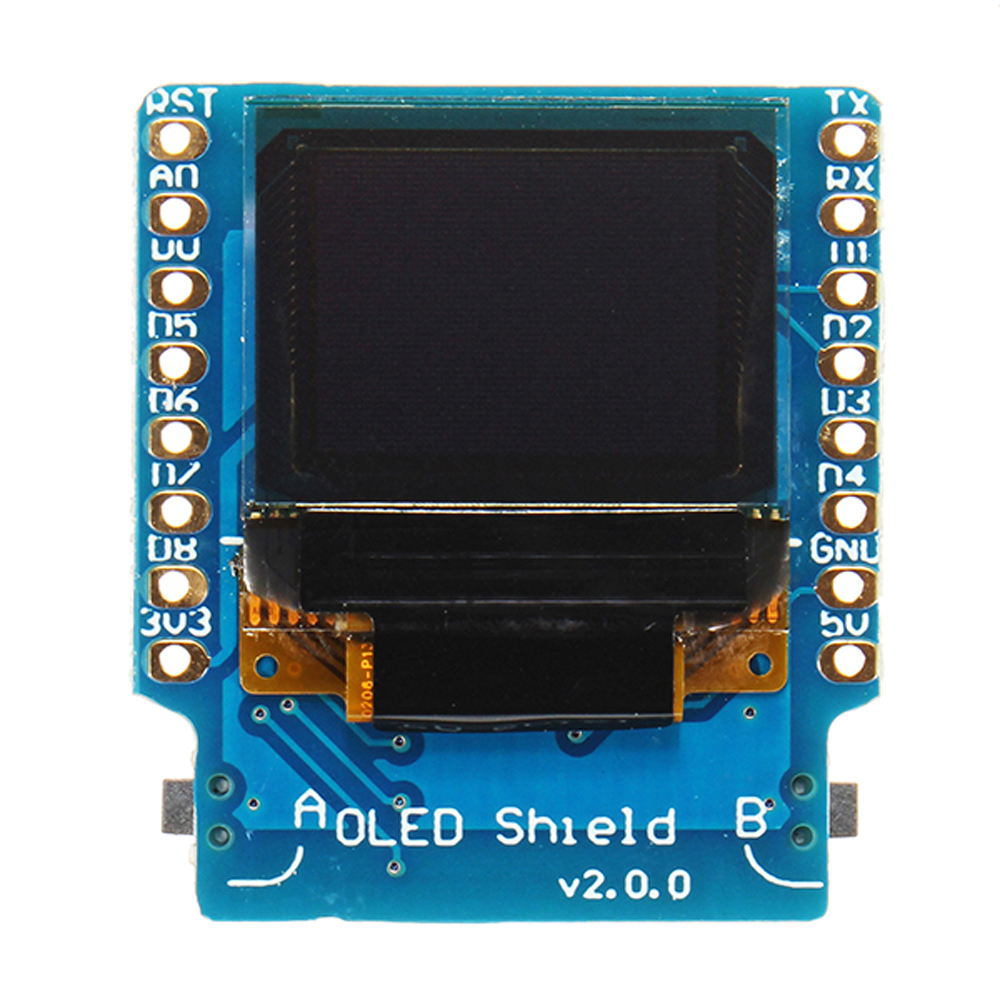
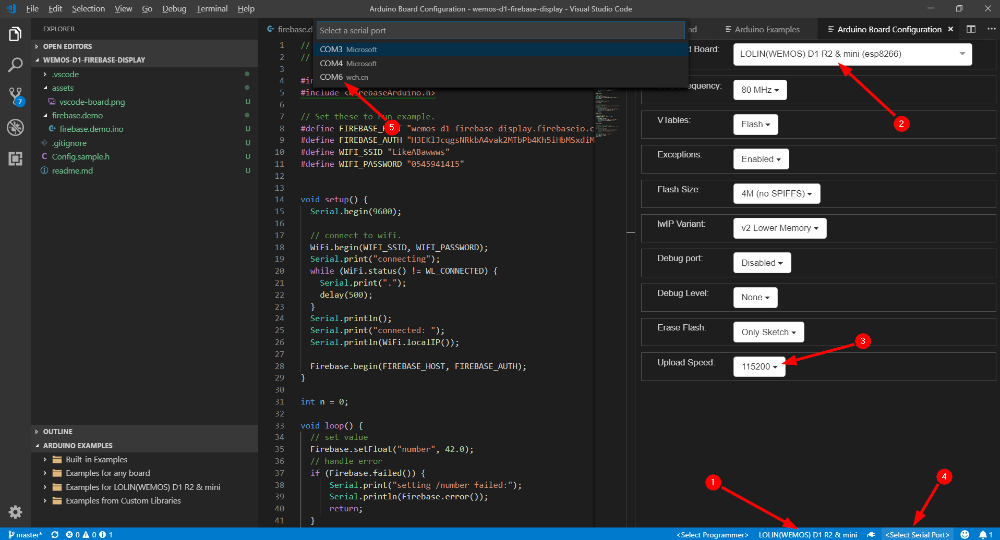

# wemos-d1-firebase-display

## Motivation
This is how me and my wife communicate these days 😁🤷‍.

My friend [Uri Shaked](https://github.com/urish/) introduced me to esp8266 and it's been almost 10 years since I've written C/C++/Embeddedd. so why not?

## Hardware 

Wemos D1 Mini</img>
 OLED 0.66'' (64x48) 

## Installation

### Arduino IDE
* download [firebase-arduino](https://github.com/googlesamples/firebase-arduino/archive/master.zip)
* Arduino Studio > Sketch > Include Library > Add .ZIP Library

### Firebase
* create new project (change the name of the project in all the following)
* navigate to [project settings](https://console.firebase.google.com/u/0/project/wemos-d1-firebase-display/settings/general)
* grab the [database secrets](https://console.firebase.google.com/u/0/project/wemos-d1-firebase-display/settings/serviceaccounts/databasesecrets)  
warning : "database secrets" are currently deprecated and use a legacy Firebase token generator. Update your source code with the Firebase Admin SDK.
* make sure you have [firebase-cli](https://github.com/firebase/firebase-tools) (`npm install -g firebase-tools`)
  
### Configuration
* rename `src/wemos/config.sample.h` to `src/wemos/config.h` and add your values
* change "wemos-d1-firebase-display" in `src/web/.firebaserc` to be your firebase project name

### Gotchas
* if you're getting 
  * `Firebase.h:26:25: fatal error: ArduinoJson.h: No such file or directory`" 
  * `FirebaseObject.h:109:21: error: 'StaticJsonBuffer' was not declared in this scope`   
* Arduino Studio > Sketch > Include Library > **make sure ArduinoJson is version 5.13.2**

## Run
* upload `src/wemos/main.display.firebase.ino` to your ESP8266 
* deploy the firebase admin webpage `$ src/web> firebase deploy`
* open the web interface (https://wemos-d1-firebase-display.firebaseapp.com/)

## Editor 
* if you're familiar with programming and used to have nice tools, maybe arduino IDE is not for you
I advise to use VSCode + Arduino extension. remember to configure the IDE as below
